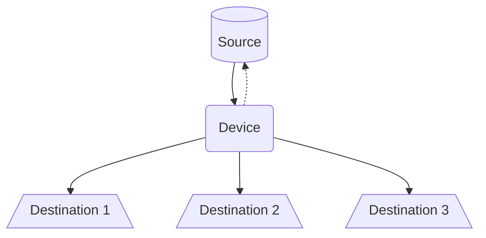

# MockPT

MockPT is a lightweight, asynchronous Python-based simulator designed to bridge the gap between static data and live IoT ecosystems. Whether you need to simulate a fleet of sensors using historical CSV data, generate synthetic noise via statistical distributions, or pipe data from one protocol to another. MockPT helps you to build your Digital Twins.

Built on top of [Orbitalis](https://github.com/orbitalis-framework/py-orbitalis) (`asyncio`-based), it is designed for high modularity development.


## Installation

Ensure you have Python 3.12+ installed. Clone the repository and install the dependencies:

```bash
pip install -r requirements.txt
```

## CLI Running

Currently, MockPT is executed as a module through the CLI. To start the simulation with your configuration file:

```bash
export PYTHONPATH=<mockpt-path>/src:$PYTHONPATH

python src/cli --config path/to/your_config.yaml
```

CLI Options:

- `-c, --config`: Path to your YAML configuration file (Required).
- `--log`: Set logging level (DEBUG, INFO, WARNING, ERROR, CRITICAL).
- `--strict-config-validation`: Enable strict validation to ensure your config adheres strictly to the schema.


## User Guide

MockPT uses a declarative YAML configuration. The logic is divided into three main blocks: Destinations, Sources, and Devices.

### Destinations

Destinations define where the data goes. You define them once and reference them in your sensors.

There are different kind of destinations up to now:

- `mqtt`:	Publishes to an MQTT broker.
- `http`:	Sends a request (POST/PUT/etc).
- `local`	Writes to a local file.

Following an example of how to use destinations:

```yaml
destinations:
  mqtt:
    type: mqtt
    broker_hostname: localhost
    broker_port: 1883

  http:
    type: http
    base_url: http://localhost:8081
    method: POST

  local:
    type: local
    directory: ./output
```

#### MQTT

```py
broker_hostname: str
broker_port: int
broker_username: Optional[str] = None
broker_password: Optional[str] = None
qos: int = 2
```

#### HTTP

```py
base_url: str
method: Literal["GET", "POST", "PUT", "DELETE"] = "POST"
headers: Optional[Dict[str, str]] = None
```

#### Local

```py
directory: str
force: bool = True
append: bool = True
separator: str = "\n"
```

Directory represents the root directory based on which file are written. If directory is not empty force must be set.

By default, new content is appended to files using `separator`, but you could switch to "write" mode using `append: false`

### Sources

Sources define where the data comes from.

- `random`: Synthetic random values.
- `csv`: Reads files. 
- `mqtt`
- `http`

Following an example of how to use sources:

```yaml
sources:
  humidity:
    type: csv
    file: ./data/humidity.csv
    timestamp_column: timestamp

  temperature:
    type: random
    rv: uniform
    min: 10
    max: 100
    step: 0.1
    interval: 5

  air_quality:
    type: mqtt
    topic: smarthome/air_quality
    broker_hostname: localhost
    broker_port: 1883

  light_level:
    type: http
    path: /smarthome/light_level
    method: POST
    host: "0.0.0.0"
    port: 8080
```

#### Random

```py
rv: str
interval: float
rv_params: Optional[Dict[str, Any]] = None
max: Optional[float] = None
min: Optional[float] = None
step: Optional[float] = None
```

Uses `scipy` to generate synthetic data. Example:  `uniform` distribution between `10` and `100` with a step of `0.1`


#### CSV

```py
file: str
columns: Optional[List[str]] = None
timestamp_column: Optional[str] = None
rotate: bool = True
interval: Optional[float] = None
```

`columns` to choose which columns must be used.

`rotate` is used to re-start data stream which file is fully read. Otherwise only data in file are provided.

If a `timestamp_column` is provided, MockPT calculates the delta between rows and replays the data in real-time.


#### MQTT

```py
topic: str
broker_hostname: str = "localhost"
broker_port: int = 1883
broker_username: Optional[str] = None
broker_password: Optional[str] = None
```

> [!TIP]
> For example, using mosquitto: `mosquitto_pub -t smarthome/air_quality -m 42`

#### HTTP

```py
path: str    
host: str = "0.0.0.0"
port: int = 8080
content_type: Optional[str] = None
method: Literal["GET", "POST", "PUT", "DELETE"] = "PUT"
ok_response_code: int = 201
fail_response_code: int = 412
```

> [!TIP]
> For example, using curl: `curl -X POST localhost:8080/smarthome/light_level -d 100`


### Device

Devices group **streams** together. Each stream has a **state** which is updated based on new data and a given **logic**. Data come from a *source* and devices notify sources about state transition outcomes. New state value is then propagated to one or more *destinations*.




For every stream you should provide:

- `source` from which data will be read
- `interval` (optional) which enable a buffering mode, overriding source frequency
- `logic` (optional, default *identity function*) represents state transition logic
- `destinations` in which you must specify an `endpoint` (its meaning depends on destination; for example, it could be a topic for MQTT or url for HTTP) 

Streams are **grouped** together in order to help user to separated streams logically. You can use arbitrary group names (excluded additional static field, i.e. `vars`).

For example, in IoT context you could split *sensors* and *actuators*, placing streams that use MQTT or HTTP sources as actuators and others as sensors.

You can use dynamic variables in your destination endpoints:

- `{device}`: The name of the device.
- `{stream}`: The name of the stream.
- `{source}`: The name of the used source.
- `{var:variable_name}`: A static variable defined in the device's `vars` block.

> [!WARNING]
> Dynamic variables are replaced during configuration parsing.

For example, a device called `smarthome` which has 2 sensors - `humidity` and `temperature` - in two different rooms and publishing both on MQTT and local file could have this following configuration:

```yaml
devices:
  smarthome:
    vars:
      room1: living_room
      room2: bedroom

    sensors:
      temperature:
        source: house1_temperature
        destinations:
          mqtt:
            endpoint: "{device}/{stream}/{var:room1}/{source}"
          local:
            endpoint: "{device}/{stream}/{var:room1}/{source}.jsonl"
            
      humidity:
        source: house1_humidity
        destinations:
          mqtt:
            endpoint: smarthome1/humidity
          local:
            endpoint: "{device}/{stream}/{var:room2}/{source}.jsonl"
```

> [!IMPORTANT]
> If you use equal names for sources, destinations and streams a prefix will be added to make them unique. Otherwise, if `--strict-config-validation` is set, then an errors is raised.

#### Logic

Logic manages the stream state transition. It is a class that inherits `StateLogic` base class. You should implement `process` method which takes new input data messages, (eventually) modifies them and returns.
Returned data messages are used to update internal state storage.

```py
class StateLogic(ABC):
    
    @abstractmethod
    def process(self, input: DataMessage) -> DataMessage:
        pass
```

By default *identity function* is used as processing function:

```py
from typing import override

from mockpt.common.message.data_message import DataMessage
from mockpt.state.logic import StateLogic


class IdentityStateLogic(StateLogic):
    
    @override
    def process(self, input: DataMessage) -> DataMessage:
        return input
```

> [!NOTE]
> You can use additional function in the file to provide custom logic both in the class itself and in global scope.

You can provided your custom logic implementing a `CustomStateLogic` class in a Python file `path/to/logic.py`, then you must provide it into stream configuration:

```yaml
sensors:
  temperature:
    source: house1_temperature
    logic: "path/to/logic.py"
    destinations:
      mqtt:
        endpoint: "{device}/{stream}/{var:room1}/{source}"
      local:
        endpoint: "{device}/{stream}/{var:room1}/{source}.jsonl"
```

An example of custom logic to provide always `42`:

```py
from typing import override

from mockpt.common.message.data_message import DataMessage
from mockpt.state.logic import StateLogic


def value(v: int):
    return { "value": v}


class FortyTwoStateLogic(StateLogic):
    
    @override
    def process(self, input: DataMessage) -> DataMessage:
        return DataMessage.of(
            source_identifier=input.source_identifier,
            value=value(42)
        )
```


## Developer Guide

MockPT is built with extensibility in mind. The core logic relies on a Dispatcher pattern and asyncio tasks.

### Architecture Overview

Each sensor defined in the configuration is instantiated as a concurrent task. The system resolves the requested Source and connects it to the defined Destinations. To prevent naming collisions between different modules, MockPT internally wraps entities with unique identifiers if names overlap.

### How to add a new Source

Sources are located in `sources/`. To add a new one:

1. Define the Config: In `config.py`, create a Pydantic-style dataclass inheriting from `SourceBaseConfig`.
2. Implement the Logic: Create a class in a new file (e.g., `my_source.py`) inheriting from `SourceBase`. Implement the `_datastream` asynchronous method which is an asynchronous generator (you must use `yield`!!!).
3. Register the Source: Update the `__init__.py`:

```py
elif type == SourceName.MY_NEW_SOURCE.value:
    return MyNewSource
```

### How to add a new Destination

Destinations follow a similar pattern in `destinations/`:

1. Define the Config: Inherit from `DestinationBaseConfig`.
2. Implement the Logic: Inherit from `DestinationBase` and implement the `_send` method.
3. Register the Destination: Update the destination dispatcher logic to recognize your new type.

