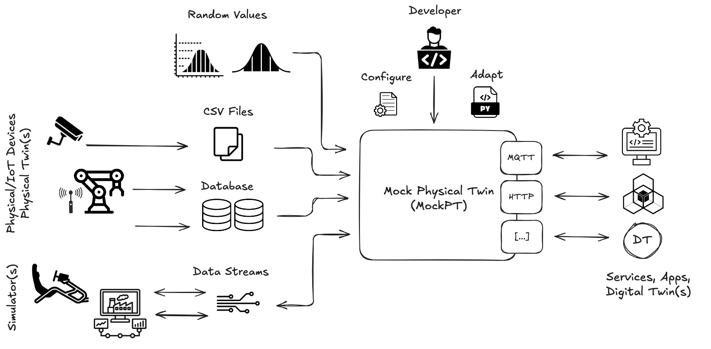
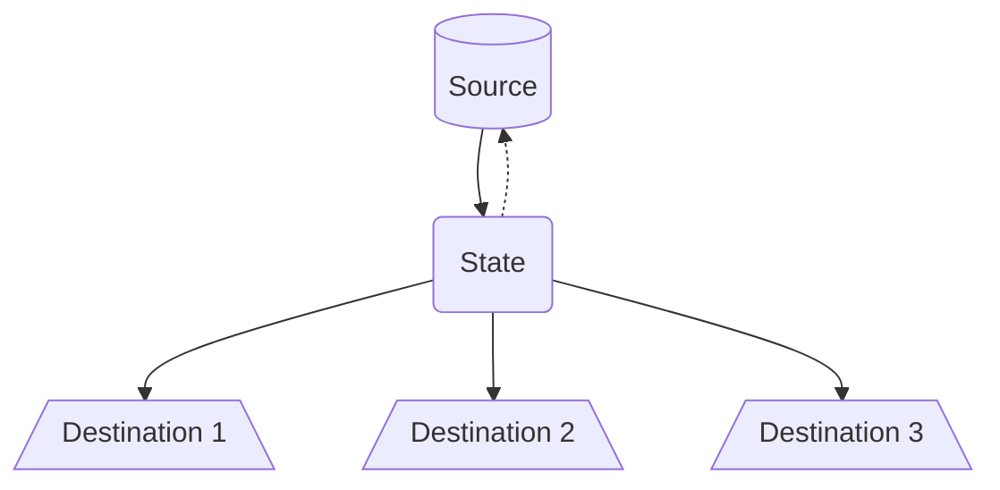
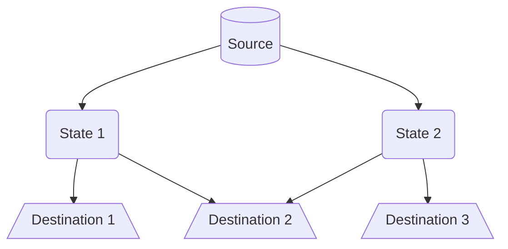
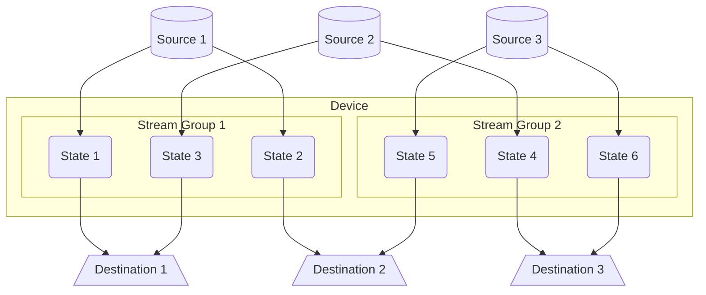
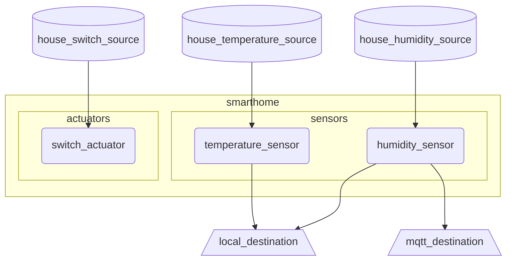
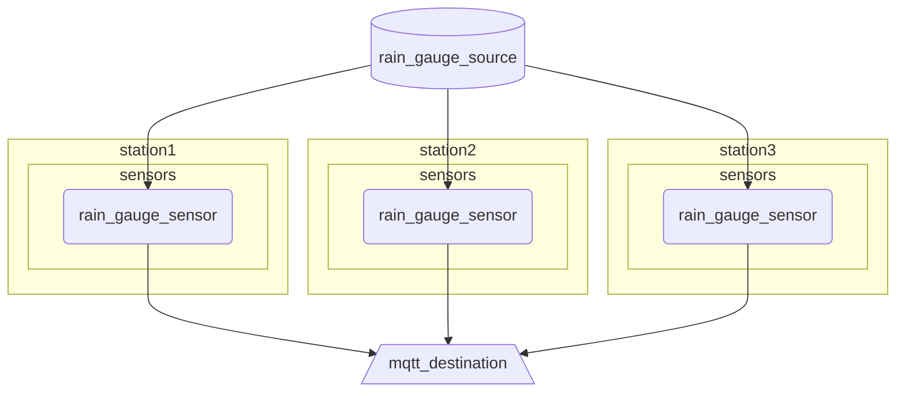

# Mock Physical Twin (MockPT)

<div align="center">
  
</div>

> **You don't always have the IoT device sitting on your desk.** Maybe you have historical data and need to build an application on top of it. Maybe you want to test a protocol, validate a pipeline, or configure complex multi-device scenarios — without waiting for physical hardware. Focus on developing your application: MockPT will take care of the rest.



MockPT is a lightweight, asynchronous Python-based simulator that acts as a **Mock Physical Twin** for IoT ecosystems. It lets you replace real physical devices with configurable software simulators, feeding your stack with realistic data streams through the same protocols your production devices would use.

Whether you need to:

- **replay historical data** from CSV files with timing management,
- **generate synthetic values** via statistical distributions (e.g. uniform, gaussian),
- **bridge protocols** by consuming data from MQTT or HTTP and republishing it elsewhere,
- or **simulate entire device fleets** with independent streams and custom logic —

MockPT also provides a set of built-in components, including MQTT and HTTP integrations as well as CSV reading capabilities. At the same time, it is designed with a modular architecture so you can extend it with new protocols, custom connectors (including database connectors), and dedicated simulators tailored to your domain.

The project lets you define and execute multiple CLI configurations, making it easy to manage different test scenarios built on the same dataset.

MockPT provides a fully functional, protocol-compatible data layer that integrates seamlessly with IoT application services and Digital Twin design and development workflows.

Built on top of [Orbitalis](https://github.com/orbitalis-framework/py-orbitalis) (`asyncio`-based), it is designed for high modularity, extensibility, and deployment flexibility.

## Installation

Ensure you have Python 3.12+ installed. Clone the repository and install the dependencies. This project uses [uv](https://docs.astral.sh/uv/getting-started/installation/) to provide a ready-to-use CLI:

```bash
cd path/to/mockpt

uv tool install .
mockpt -h

# or

uv run mockpt -h
```

CLI Options:

- `-c, --config`: Path to your YAML configuration file (Required).
- `--log`: Set logging level (DEBUG, INFO, WARNING, ERROR, CRITICAL).
- `--strict-config-validation`: Enable strict validation to ensure your config adheres strictly to the schema.

<!-- ## Development & Direct Execution 

... -->

## Concepts & Main Components

MockPT is built upon **Stream** concept, which is a structured flow of information which involves:

- One **Source** which provides data (grounded on CSV files, randomly generated or protocol-based)
- A **State** which is the core of a stream, processing and storing the last valid value provided by the source
- One or more **Destinations** which expose data in different ways (e.g. MQTT or HTTP) 



States are equipped with a "logic" function which is used to manipulate input data and to manage state transition, because we would prevent state update if a wrong or inconsistent value comes.

Sources and destinations are **shared** and **independent** with respect to streams. This means that we declare them once and reuse multiple times. 



MockPT manages streams grouping them in **Stream Groups**. 
One or more stream groups are related to a **Device**, which contains them and other additional information. We can declare more devices.

Device concept allows us to declare the most intuitive structure, particularly related to IoT world: *"a device which has some sensors and some actuators"*. In this case, sensors and actuators are stream groups and each sensor/actuator is a stream.



Devices, sources and destinations can be managed through an YAML configuration file.


### Stream

For every stream you should provide:

- `source` from which data will be read
- `interval` (optional) which enable a buffering mode, overriding source frequency
- `logic` (optional, default *identity function*) represents state transition logic
- `destinations` in which you must specify an `endpoint` (its meaning depends on destination; for example, it could be a topic for MQTT or url for HTTP) 

You can use dynamic variables in your destination endpoints:

- `{device}`: The name of the device.
- `{stream}`: The name of the stream.
- `{source}`: The name of the used source.
- `{var:variable_name}`: A static variable defined in the device's `vars` block.

> [!WARNING]
> Dynamic variables are replaced during configuration parsing.

For example, a stream related to temperature data flow could be represented:

```yml
temperature_stream:
    source: temperature_source
    logic: "path/to/logic.py"
    destinations:
      mqtt:
        endpoint: "endpoint1"
      local:
        endpoint: "endpoint2"
```

#### Logic

Logic manages the stream state transition. It is a class that inherits `StateLogic` base class. You should implement `process` method which takes new input data messages, (eventually) modifies them and returns.
Returned data messages are used to update internal state storage.

```py
class StateLogic(ABC):
    
    @abstractmethod
    def process(self, input: DataMessage) -> DataMessage:
        pass
```

By default *identity function* is used as processing function:

```py
from typing import override
from mockpt.common.message.data_message import DataMessage
from mockpt.state.logic import StateLogic


class IdentityStateLogic(StateLogic):
    
    @override
    def process(self, input: DataMessage) -> DataMessage:
        return input
```

> [!NOTE]
> You can use additional function in the file to provide custom logic both in the class itself and in global scope.

You can provided your custom logic implementing a `CustomStateLogic` class in a Python file `path/to/logic.py`, then you must provide it into stream configuration:

```yaml
sensors:
  temperature:
    source: house1_temperature
    logic: "path/to/logic.py"
    destinations:
      mqtt:
        endpoint: "{device}/{stream}/{var:room1}/{source}"
      local:
        endpoint: "{device}/{stream}/{var:room1}/{source}.jsonl"
```

An example of custom logic to provide always `42`:

```py
from typing import override
from mockpt.common.message.data_message import DataMessage
from mockpt.state.logic import StateLogic


def value(v: int):
    return { "value": v}


class FortyTwoStateLogic(StateLogic):
    
    @override
    def process(self, input: DataMessage) -> DataMessage:
        return DataMessage.of(
            source_identifier=input.source_identifier,
            value=value(42)
        )
```


### Device

Devices group **streams** together in order to help user to separated streams logically. You can use arbitrary group names (excluded additional static field, i.e. `vars`).

For example, in IoT context you could split *sensors* and *actuators*, placing streams that use MQTT or HTTP sources as actuators and others as sensors.

> [!IMPORTANT]
> If you use equal names for sources, destinations and streams a prefix will be added to make them unique. Otherwise, if `--strict-config-validation` is set, then an errors is raised.


For example, a device called `smarthome` which has 2 sensors - `humidity` and `temperature` - in two different rooms, publishing on MQTT and local file and with an actuator `switch` to turn on/off light using MQTT could have this following configuration:

```yaml
devices:
  smarthome:
    vars:
      room1: living_room
      room2: bedroom

    sensors:
      temperature_sensor:
        source: house_temperature_source
        destinations:
          local_destination:
            endpoint: "{device}/{stream}/{var:room1}/{source}.jsonl"
            
      humidity_sensor:
        source: house_humidity_source
        destinations:
          mqtt_destination:
            endpoint: smarthome/humidity
          local_destination:
            endpoint: "{device}/{stream}/{var:room2}/{source}.jsonl"

    actuators:
      switch_actuator:
        source: house_switch_source
        logic: "path/to/switch_logic.py"
```

In particular, in this example, there are 3 independent sources which serve 3 different states: switch (actuator), temperature (sensor) and humidity (sensor). This is reasonable, because we are considering completely different streams.

Focussing on humidity stream, data are generated (or retrieved from disk/protocol based on source type) by `house_humidity_source` source (which is not shown in the YML) and sent to `humidity_sensor` stream (state). Given that there is no explicit `logic` parameter, identity function is used. This means that there are no data validation or manipulation and source data are exposed through `local_destination` and `mqtt_destination` destinations as-it-is.  




Let's consider another example: a set of meterological stations which have a rain gauge sensor which publish on MQTT.

```yaml
devices:
  station1:
    vars:
      location: "Modena"
    sensors:
      rain_gauge_sensor:
        source: rain_gauge_source
        destinations:
          mqtt_destination:
            endpoint: "{device}/{var:location}"

  station2:
    vars:
      location: "Reggio Emilia"
    sensors:
      rain_gauge_sensor:
        source: rain_gauge_source
        destinations:
          mqtt_destination:
            endpoint: "{device}/{var:location}"

  station3:
    vars:
      location: "Mantova"
    sensors:
      rain_gauge_sensor:
        source: rain_gauge_source
        destinations:
          mqtt_destination:
            endpoint: "{device}/{var:location}"
```

In this case `rain_gauge_source` is shared among stations (so they will publish same data).



### Destinations

Destinations define where the data goes. You define them once and reference them in your sensors.

There are different kind of destinations up to now:

- `mqtt`:	Publishes to an MQTT broker.
- `http`:	Sends a request (POST/PUT/etc).
- `local`	Writes to a local file.

Following an example of how to use destinations:

```yaml
destinations:
  mqtt:
    type: mqtt
    broker_hostname: localhost
    broker_port: 1883

  http:
    type: http
    base_url: http://localhost:8081
    method: POST

  local:
    type: local
    directory: ./output
```

#### MQTT

```py
broker_hostname: str
broker_port: int
broker_username: Optional[str] = None
broker_password: Optional[str] = None
qos: int = 2
```

#### HTTP

```py
base_url: str
method: Literal["GET", "POST", "PUT", "DELETE"] = "POST"
headers: Optional[Dict[str, str]] = None
```

#### Local

```py
directory: str
force: bool = True
append: bool = True
separator: str = "\n"
```

Directory represents the root directory based on which file are written. If directory is not empty force must be set.

By default, new content is appended to files using `separator`, but you could switch to "write" mode using `append: false`

### Sources

Sources define where the data comes from.

- `random`: Synthetic random values.
- `csv`: Reads files. 
- `mqtt`
- `http`

Following an example of how to use sources:

```yaml
sources:
  humidity:
    type: csv
    file: ./data/humidity.csv
    timestamp_column: timestamp

  temperature:
    type: random
    rv: uniform
    min: 10
    max: 100
    step: 0.1
    interval: 5

  air_quality:
    type: mqtt
    topic: smarthome/air_quality
    broker_hostname: localhost
    broker_port: 1883

  light_level:
    type: http
    path: /smarthome/light_level
    method: POST
    host: "0.0.0.0"
    port: 8080
```

#### Random

```py
rv: str
interval: float
rv_params: Optional[Dict[str, Any]] = None
max: Optional[float] = None
min: Optional[float] = None
step: Optional[float] = None
```

Uses `scipy` to generate synthetic data. Example:  `uniform` distribution between `10` and `100` with a step of `0.1`


#### CSV

```py
file: str
columns: Optional[List[str]] = None
timestamp_column: Optional[str] = None
rotate: bool = True
interval: Optional[float] = None
```

`columns` to choose which columns must be used.

`rotate` is used to re-start data stream which file is fully read. Otherwise only data in file are provided.

If a `timestamp_column` is provided, MockPT calculates the delta between rows and replays the data in real-time.


#### MQTT

```py
topic: str
broker_hostname: str = "localhost"
broker_port: int = 1883
broker_username: Optional[str] = None
broker_password: Optional[str] = None
```

> [!TIP]
> For example, using mosquitto: `mosquitto_pub -t smarthome/air_quality -m 42`

#### HTTP

```py
path: str    
host: str = "0.0.0.0"
port: int = 8080
content_type: Optional[str] = None
method: Literal["GET", "POST", "PUT", "DELETE"] = "PUT"
ok_response_code: int = 201
fail_response_code: int = 412
```

> [!TIP]
> For example, using curl: `curl -X POST localhost:8080/smarthome/light_level -d 100`


### Complete example

```yml
destinations:
  mqtt:
    type: mqtt
    broker_hostname: localhost
    broker_port: 1883

  http:
    type: http
    base_url: http://localhost:8081
    method: POST

  local:
    type: local
    directory: ./output


sources:
  humidity:
    type: csv
    file: ./data/humidity.csv
    timestamp_column: timestamp

  temperature:
    type: random
    rv: uniform
    min: 10
    max: 100
    step: 0.1
    interval: 5

  air_quality:
    type: mqtt
    topic: smarthome/air_quality
    broker_hostname: localhost
    broker_port: 1883

  light_level:
    type: http
    path: /smarthome/light_level
    method: POST
    host: "0.0.0.0"
    port: 8080

devices:
  smarthome:
    vars:
      room1: living_room
      room2: bedroom

    plcs:
      reg:
        source: temperature
        destinations:
          local:
            endpoint: "reg.txt"

    sensors:
      temperature:
        source: temperature
        logic: ./processor.py
        destinations:
          mqtt:
            endpoint: "{device}/{stream}/{var:room1}/{source}"
          http:
            endpoint: smarthome/temperature
          local:
            endpoint: "{device}/{stream}/{var:room1}/{source}.txt"
            
      humidity:
        source: humidity
        destinations:
          mqtt:
            endpoint: smarthome/humidity
          http:
            endpoint: smarthome/humidity
          local:
            endpoint: "{device}/{stream}/{var:room2}/{source}.txt"

      air_quality:
        source: air_quality
        destinations:
          mqtt:
            endpoint: "{source}"
          http:
            endpoint: smarthome/air_quality
          local:
            endpoint: "{device}/{source}.txt"

      light_level:
        source: light_level
        destinations:
          mqtt:
            endpoint: "{device}/{source}"
          http:
            endpoint: smarthome/light_level
          local:
            endpoint: "{device}/{source}.txt"

    actuators:
      switch:
        source: http
        destinations:
          mqtt:
            endpoint: smarthome/switch
```


## Developer Guide

MockPT is built with extensibility in mind. The core logic relies on a Dispatcher pattern and asyncio tasks.

First of all, you should install requirements:

```bash
pip install -r requirements.txt
```

### Architecture Overview

Each sensor defined in the configuration is instantiated as a concurrent task. The system resolves the requested Source and connects it to the defined Destinations. To prevent naming collisions between different modules, MockPT internally wraps entities with unique identifiers if names overlap.

### How to add a new Source

Sources are located in `sources/`. To add a new one:

1. Define the Config: In `config.py`, create a Pydantic-style dataclass inheriting from `SourceBaseConfig`.
2. Implement the Logic: Create a class in a new file (e.g., `my_source.py`) inheriting from `SourceBase`. Implement the `_datastream` asynchronous method which is an asynchronous generator (you must use `yield`!!!).
3. Register the Source: Update the `__init__.py`:

```py
elif type == SourceName.MY_NEW_SOURCE.value:
    return MyNewSource
```

### How to add a new Destination

Destinations follow a similar pattern in `destinations/`:

1. Define the Config: Inherit from `DestinationBaseConfig`.
2. Implement the Logic: Inherit from `DestinationBase` and implement the `_send` method.
3. Register the Destination: Update the destination dispatcher logic to recognize your new type.


## Author

<div style="display: flex; flex-direction: column; gap: 25px;">
    <!-- Marco Picone --> 
    <div style="display: flex; align-items: center; gap: 15px;"> 
         
        <div> 
            <h3 style="margin: 0;">Prof. Marco Picone</h3> 
            <p style="margin: 4px 0;">Associate Professor<br> University of Modena and Reggio Emilia, Department of Sciences and Methods for Engineering (DISMI)</p> 
            <div> 
                <a href="https://www.linkedin.com/in/marco-picone-8a6a4612/">  </a> 
                <a href="https://github.com/piconem" style="margin-left: 8px;">  </a> 
            </div> 
        </div> 
    </div>
    <!-- Nicola Ricciardi --> 
    <div style="display: flex; align-items: center; gap: 15px;"> 
         
        <div> 
            <h3 style="margin: 0;">Nicola Ricciardi</h3> 
            <p style="margin: 4px 0;">Student<br>University of Modena and Reggio Emilia, Department of Sciences and Methods for Engineering (DISMI)</p> 
            <div> 
                <a href="https://www.linkedin.com/in/nicola-ricciardi-9982a1297/"> </a> 
                <a href="https://github.com/nricciardi" style="margin-left: 8px;">  </a> 
            </div> 
        </div> 
    </div>
    <!-- Marco Melloni --> 
    <div style="display: flex; align-items: center; gap: 15px;"> 
         
        <div> 
            <h3 style="margin: 0;">Marco Melloni</h3> 
            <p style="margin: 4px 0;">Graduated Digital Automation Engineering Student<br>University of Modena and Reggio Emilia, Department of Sciences and Methods for Engineering (DISMI)</p> 
            <div> 
                <a href="https://www.linkedin.com/in/marco-melloni/"> </a> 
                <a href="https://github.com/marcomelloni" style="margin-left: 8px;">  </a> 
            </div> 
        </div> 
    </div>
    <!-- Davide Ziglioli --> 
    <div style="display: flex; align-items: center; gap: 15px;"> 
         
        <div> 
            <h3 style="margin: 0;">Davide Ziglioli</h3> 
            <p style="margin: 4px 0;">Graduated Digital Automation Engineering Student<br> University of Modena and Reggio Emilia, Department of Sciences and Methods for Engineering (DISMI)</p> 
            <div> 
                <a href="https://www.linkedin.com/in/davide-ziglioli/"> 
                 </a> 
                <a href="https://github.com/davide-z99" style="margin-left: 8px;">  </a> 
            </div> 
        </div>
    </div> 
</div>

